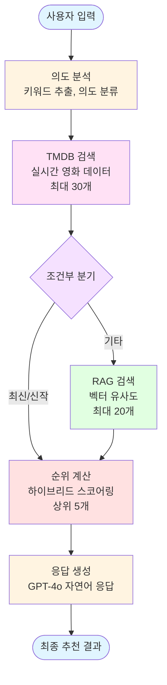
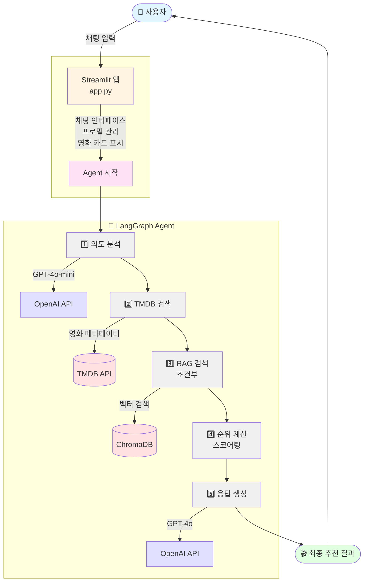

# 🎬 AI 영화 추천 시스템

> LangGraph와 RAG를 활용한 지능형 하이브리드 영화 추천 Agent

~~🔗 **https://movie.youngho.me**~~ (비용 이슈로 배포 중단)

대화형 AI가 사용자 취향을 학습하여 TMDB API와 벡터 검색을 결합한 개인화된 영화를 추천합니다.

## ✨ 주요 기능

- 🤖 **지능형 대화**: GPT-4o 기반 자연어 이해 및 응답 생성
- 🔍 **하이브리드 검색**: TMDB API + RAG 벡터 검색 결합
- 🧠 **개인화 학습**: 대화를 통한 취향 자동 학습 및 프로필 구축
- 🎯 **다차원 랭킹**: 평점, 인기도, 유사도, 장르 매칭을 고려한 스마트 순위화

## 🛠️ 기술 스택

### AI & ML
- **LangChain** / **LangGraph**: Agent 워크플로우 오케스트레이션
- **OpenAI GPT-4o / GPT-4o-mini**: 의도 분석 및 응답 생성
- **OpenAI text-embedding-3-small**: 영화 설명 벡터화

### 데이터 & 검색
- **ChromaDB**: 벡터 저장 및 유사도 검색
- **TMDB API**: 영화 메타데이터 및 실시간 정보

### 프론트엔드
- **Streamlit**: 대화형 웹 인터페이스

### 개발 도구
- **Python 3.11+**
- **Claude Code**: AI 페어 프로그래밍

## 🌟 주요 특징

### 1. LangGraph 워크플로우

Agent는 5단계 노드로 구성된 그래프 기반 워크플로우를 실행합니다:



### 2. 하이브리드 검색 전략

**TMDB API**
- 실시간 메타데이터 (평점, 인기도, 개봉일)
- 장르 기반 필터링
- 제목 검색

**RAG 벡터 검색**
- 영화 줄거리 + 키워드 임베딩
- 의미 기반 유사도 계산
- "인터스텔라 같은 영화" 등 유사 영화 추천

**스코어링 알고리즘**
```python
최종 점수 = (평점 × 0.5)
          + (인기도 × 0.3)
          + (RAG 유사도 × 2.0)
          + (장르 매칭 × 1.5)
          - (회피 장르 × 5.0)
```

### 3. 개인화 시스템

- **자동 프로필 구축**: 대화에서 선호 장르/분위기 추출
- **좋아요/싫어요 피드백**: 영화별 선호도 수집
- **프로필 기반 추천**: 학습된 취향을 검색 쿼리에 반영
- **세션 유지**: Streamlit 세션으로 대화 컨텍스트 유지

## 📦 설치 방법

### 1. 요구사항

- **Python**: 3.11 이상
- **API 키**:
  - [OpenAI API 키](https://platform.openai.com/api-keys)
  - [TMDB API 키](https://www.themoviedb.org/settings/api)

### 2. 의존성 설치

```bash
# 저장소 클론
git clone https://github.com/youngho98/movie-recommender.git
cd movie-recommender

# 가상환경 생성 (선택사항)
python -m venv venv
source venv/bin/activate  # Windows: venv\Scripts\activate

# 의존성 설치
pip install -r requirements.txt
```

### 3. 환경 변수 설정

`.env` 파일을 생성하고 API 키를 설정합니다:

```bash
# .env.example을 복사
cp .env.example .env
```

`.env` 파일 내용:
```env
# OpenAI API
OPENAI_API_KEY=sk-...

# TMDB API
TMDB_API_KEY=your_tmdb_api_key

# 선택적 설정
CHROMA_DB_PATH=./chroma_db
EMBEDDING_MODEL=text-embedding-3-small
GPT_MODEL=gpt-4o-mini
GPT_RESPONSE_MODEL=gpt-4o
MAX_MOVIES=5000
BATCH_SIZE=100
```

## 🚀 실행 방법

### 1. RAG 데이터베이스 구축 (선택사항)

처음 실행 시 또는 최신 영화 데이터를 사용하려면 RAG DB를 구축합니다:

```bash
# 테스트용 (100개 영화)
python scripts/build_rag.py --limit 100

# 실제 운영용 (5000개 영화, 약 30분 소요)
python scripts/build_rag.py --limit 5000 --start-year 2010 --min-rating 7.0
```

옵션:
- `--limit`: 수집할 영화 수 (기본: 100)
- `--start-year`: 수집 시작 연도 (기본: 2000)
- `--min-rating`: 최소 평점 (기본: 6.0)
- `--persist-dir`: ChromaDB 저장 경로

### 2. 앱 실행

```bash
streamlit run app.py
```

브라우저에서 `http://localhost:8501` 접속

### 3. 사용 방법

1. 채팅창에 영화 관련 질문 입력:
   - "SF 영화 추천해줘"
   - "인터스텔라 같은 영화"
   - "감동적인 드라마 찾아줘"

2. 추천 받은 영화에 좋아요/싫어요 클릭

3. 사이드바에서 학습된 취향 확인

4. langsmith에서 llm 모니터링도 가능 (.env 파일에 langsmith api key 입력 필요)


## 🚀 배포

### 배포 환경
- **클라우드**: AWS EC2 (t3.small)
- **OS**: Ubuntu 24.04 LTS
- **컨테이너**: Docker + Docker Compose
- **웹서버**: Nginx (리버스 프록시)
- **SSL**: Let's Encrypt (자동 갱신)
- **스토리지**: 30GB EBS gp3
- **도메인**: movie.youngho.me

### 아키텍처
```
사용자
  ↓ HTTPS:443
Nginx (SSL 종료, 리버스 프록시)
  ↓ HTTP:8501
Docker Container
  └─ Streamlit App
      ├─ LangGraph Agent
      ├─ ChromaDB (RAG)
      └─ OpenAI API
```

### 시스템 스펙
- **CPU**: 2 vCPU (t3.small)
- **메모리**: 2GB RAM
- **스토리지**: 30GB (증설 가능)
- **네트워크**: 고정 IP (탄력적 IP)

### 주요 특징
- ✅ HTTPS 보안 연결
- ✅ 도커 컨테이너 격리
- ✅ 자동 SSL 인증서 갱신
- ✅ 무중단 재시작 (restart policy)
- ✅ 헬스체크 기능

## 📂 프로젝트 구조

```
movie-recommender/
├── src/
│   ├── config.py              # 전역 설정 및 환경 변수
│   ├── tmdb/
│   │   └── api.py             # TMDB API 클라이언트
│   ├── rag/
│   │   ├── embeddings.py      # OpenAI 임베딩 생성
│   │   ├── vector_store.py    # ChromaDB 관리
│   │   └── search.py          # RAG 검색 엔진
│   └── agent/
│       ├── state.py           # Agent 상태 정의
│       ├── nodes.py           # LangGraph 노드 함수
│       └── graph.py           # Agent 워크플로우 그래프
├── scripts/
│   └── build_rag.py           # RAG DB 구축 스크립트
├── app.py                     # Streamlit 앱
├── requirements.txt           # Python 의존성
├── .env.example               # 환경 변수 템플릿
├── .gitignore                 # Git 제외 파일
├── CLAUDE.md                  # Claude Code 개발 가이드
└── README.md                  # 프로젝트 문서
```

## 🏗️ 아키텍처

### 시스템 다이어그램



### 데이터 흐름

1. **입력 단계**: 사용자 입력 → 프로필 로드
2. **분석 단계**: GPT-4o-mini로 의도/키워드 추출
3. **검색 단계**:
   - TMDB: 장르/제목 기반 검색
   - RAG: 임베딩 유사도 검색
4. **병합 단계**: 중복 제거 및 하이브리드 스코어 계산
5. **출력 단계**: GPT-4o로 자연어 응답 생성
6. **학습 단계**: 프로필 업데이트 (백그라운드)

## 📊 성능 지표

### 응답 시간 (평균)
- 의도 분석: ~2초
- TMDB 검색: ~1초
- RAG 검색: ~3초
- 순위 계산: <1초
- 응답 생성: ~3초
- **총 소요 시간**: 약 10초

### 비용 (요청당)
- GPT-4o-mini (의도 분석): ~$0.001
- GPT-4o (응답 생성): ~$0.005
- Embedding (프로필 업데이트): ~$0.0001
- **총 비용**: ~$0.006/요청

### RAG DB 구축
- 5000개 영화: ~30분
- 임베딩 비용: ~$0.05
- 저장 공간: ~500MB

## 👨‍💻 개발 프로세스

이 프로젝트는 **AI 페어 프로그래밍** 방식으로 개발되었습니다:

### 역할 분담

**개발자 (직접 수행)**
- 아키텍처 설계
- 알고리즘 설계 (스코어링, 라우팅)
- 데이터 흐름 설계
- 코드 리뷰 및 검증
- 테스트 및 디버깅

**Claude Code (AI 협업)**
- 보일러플레이트 코드 생성
- API 클라이언트 구현
- 에러 처리 로직
- Docstring 및 주석
- 코드 리팩토링

### 개발 원칙

CLAUDE.md에 정의된 코딩 규칙 준수:
- 모든 함수에 타입 힌팅 필수
- Google Style Docstring 필수
- 에러 처리 및 로깅 필수
- 명확한 변수명 사용

### 철학

> "AI는 타이핑 시간을 줄여주는 도구일 뿐,
> 최종 책임과 이해는 개발자에게 있습니다."

## 🐛 알려진 이슈

- RAG 검색 시 한국어 임베딩 품질 개선 필요
- 사용자 프로필 영구 저장 미지원 (세션 종료 시 초기화)
- 대용량 대화 히스토리 시 메모리 사용량 증가

## 🤝 기여 방법

1. Fork the Project
2. Create your Feature Branch (`git checkout -b feature/AmazingFeature`)
3. Commit your Changes (`git commit -m 'Add some AmazingFeature'`)
4. Push to the Branch (`git push origin feature/AmazingFeature`)
5. Open a Pull Request

## 📄 라이선스

이 프로젝트는 MIT 라이선스 하에 배포됩니다.

## 📧 연락처

프로젝트 관련 문의: youngho.dev@gmail.com

프로젝트 링크: [https://github.com/youngho98/movie-recommender](https://github.com/youngho98/movie-recommender)
